# Navigation Spec — Capital

**Version:** 0.7.0
**Status:** Draft
**Owner:** Danielle Mariani
**Created at:** 2026-05-23
**Last Updated:** 2026-06-08

---

## Overview

This document defines the navigation structure, screen inventory, and flow for the Budget App across platforms. It serves as the reference for feature spec authors — every screen referenced in a feature spec should trace back to this document.

Phase 1 covers the Android app. Phase 3 covers the web dashboard. iOS and cross-platform navigation are deferred to Phase 4.

This document is intentionally lightweight — it captures structure and flow, not visual design or component-level UI detail. Those are defined per feature spec.

---

## Related Documents

| Document | Purpose |
|---|---|
| SPEC.md | Feature index and global business rules |
| ARCHITECTURE.md | Android stack and navigation implementation (Jetpack Compose Navigation) |
| specs/features/onboarding/spec.md | Onboarding feature detail |
| specs/features/dashboard/spec.md | Dashboard feature detail |
| specs/features/transactions/spec.md | Transactions feature detail |
| specs/features/transfers/spec.md | Transfers feature detail |
| specs/features/accounts/spec.md | Accounts feature detail |
| specs/features/budgets/spec.md | Budgets feature detail |
| specs/features/goals/spec.md | Goals feature detail |
| specs/features/categories/spec.md | Categories feature detail |
| specs/features/merchants/spec.md | Merchants feature detail |
| specs/features/home/requirements.md | Home shell — MainActivity, header, bottom nav, back navigation |
| specs/features/settings/requirements.md | Settings feature detail |

---

## Global Navigation Patterns

These patterns apply across all screens unless a feature spec explicitly overrides them.

### Detail Screen vs Direct Edit

Entity types follow one of two interaction patterns on row tap:

| Entity | Tap behavior | Edit access |
|---|---|---|
| Account | Opens Account Detail screen | Pencil icon on detail screen |
| Budget | Opens Budget Detail screen | Pencil icon on detail screen |
| Goal | Opens Goal Detail screen | Pencil icon on detail screen |
| Transaction | Opens Transaction Edit form directly | — |
| Transfer | Opens Transfer Edit form directly | — |
| Goal Contribution | Opens Goal Contribution Edit form directly | — |
| Category | Opens Category Edit form directly | — |
| Merchant | Opens Merchant Edit form directly | — |

**Rationale:** Accounts, Budgets, and Goals have rich contextual detail (charts, history, computed totals) that warrants a dedicated detail screen. Simpler entities open the edit form directly — faster and more appropriate for frequent edits.

### Pin Button

Account Detail, Budget Detail, and Goal Detail screens each have a pin icon in the top area of the screen (consistent with the Google Keep note pin pattern). The icon toggles between pinned (filled) and unpinned (outline) state. Tapping it toggles `is_pinned` and updates `pinned_at`.

Pinned items always appear at the top of their respective list screens, sorted by `pinned_at` ascending (earliest pinned appears first). Unpinned items follow in their default sort order below.

The pin button is not present on list screens, edit forms, or creation forms.

### FAB Patterns

Two FAB variants are used, consistent with Material Design 3:

**Standard FAB** — single primary action. Used on Budget list, Goal list, Category list, and Merchant list screens.

**Speed Dial FAB** — expands on tap to reveal 2–5 labeled sub-actions. Used on Transactions screen (Add Transaction, Add Transfer) and Accounts screen (Add Checking, Add Savings, Add Cash, Add Credit Card). Speed Dial is only used when there are multiple distinct creation actions on the same screen.

### Soft Delete Confirmation

All destructive actions (delete transaction, delete account, clear all data, etc.) require a confirmation dialog before executing. No silent deletes anywhere in the app.

### Month Navigator

A reusable component used on Transactions and Budget list screens. Displays the selected month and year (e.g. "May 2026") with a left arrow (previous month) and a right arrow (next month). The right arrow is disabled when the selected month is the current month — the user cannot navigate into the future.

TBD: Tapping the month label may open a month picker for fast navigation to any past month. Deferred — open for Phase 1 implementation decision.

### Empty States

Every list screen defines two layers of empty state where applicable:

1. **Dependency not met** — a required prerequisite entity does not exist yet. The empty state guides the user to create the prerequisite first.
2. **No data yet** — prerequisites exist but no records have been created. The empty state encourages the user to create their first record.

Empty state anatomy: illustration placeholder + headline + subtext + primary CTA button.

### Sub-Screen Navigation

Sub-screens (detail screens, creation forms, and edit forms) are displayed full-screen within `MainActivity`. This is a global pattern that applies across all features.

**What changes on a sub-screen:**
- The shell `AppHeader` (context-sensitive label + optional gear icon) is not visible
- The `BottomNavigationBar` is not visible
- A feature-owned top bar replaces the shell header, containing:
  - **Back arrow** (left) — tapping it triggers the same behavior as the system back button or back gesture, popping the current screen from the stack
  - **Screen title** (left of center or centered) — typically the entity name (e.g. "Chase Checking") or a generic label (e.g. "Add Account"). Defined per feature spec.
  - **Optional actions** (right) — feature-specific (e.g. pencil/edit icon, pin icon). Defined per feature spec.

**What stays the same:**
- System back button and back gesture behavior — each back press pops one screen until the tab root is reached, at which point tab-level back navigation applies (see `specs/features/home/requirements.md` — RQ-HM-15 and RQ-HM-16)
- Theme (light/dark) and design system tokens

**Applies to:** Accounts, Budgets, Goals, Transactions, Transfers, Workspace Management, Settings, and any future feature that introduces sub-screens. The exact top bar composition (title, actions) is defined per feature spec.

---

## Android Navigation

### App Launch Logic

On every launch, the app reads the `onboarding_completed` flag from SharedPreferences before deciding which activity to start:

```
App Launch
    │
    └──► Read onboarding_completed from SharedPreferences
              │
              ├── false (or not set) ──► OnboardingActivity
              │                               └──► Set Your Name completed: set onboarding_completed = true
              │                                         └──► MainActivity
              │
              └── true ──► MainActivity directly
```

`onboarding_completed` is a boolean stored in SharedPreferences. It defaults to false (missing key is treated as false). It is set to true only when the user completes the Set Your Name step and taps Continue — not when the feature slides are skipped and not when Account Setup is completed or skipped.

**Phase 2 note:** when Supabase Auth is introduced, the launch check gains a second condition. The full Phase 2 logic becomes:

```
App Launch
    │
    └──► onboarding_completed?
              ├── false ──► OnboardingActivity
              └── true ──► valid Supabase session?
                                ├── yes ──► MainActivity
                                └── no ──► Login screen
```

The SharedPreferences flag remains the Phase 1 gate. The session check is layered on top in Phase 2 without changing the flag's meaning.

### App Structure

The Android app uses two distinct activity contexts:

```
OnboardingActivity         — shown only on first launch; no bottom nav, no header
    └── OnboardingNavHost  — manages onboarding screen flow

MainActivity               — all post-onboarding screens
    ├── AppHeader          — context-sensitive label (centered) + optional gear icon (right, Dashboard only)
    ├── BottomNavigationBar — 5 destinations, icon only (no labels)
    └── MainNavHost        — manages all feature screen flows
```

**OnboardingActivity** is a self-contained navigation scope. It is dismissed permanently after onboarding completes. It does not share the navigation back stack with MainActivity.

**MainActivity** is the persistent shell for all post-onboarding screens. The header and bottom nav bar are visible on all tab root screens. Sub-screens (detail screens, creation forms, edit forms) are displayed full-screen — the shell header and bottom nav are not present. See Sub-Screen Navigation pattern above.

### Header

Present on all tab root screens within `MainActivity`. Not present during onboarding or on sub-screens. The header auto-hides when the user scrolls down and reappears when the user scrolls up (`enterAlwaysScrollBehavior`), on all tabs.

| Active tab | Label | Label font | Gear icon |
|---|---|---|---|
| Dashboard | "Capital" | Borel | Visible (right) — navigates to Settings |
| Accounts | "Accounts" | Inter | Hidden |
| Transactions | "Transactions" | Inter | Hidden |
| Budgets | "Budgets" | Inter | Hidden |
| Goals | "Goals" | Inter | Hidden |

The label is centered horizontally in all cases. It is a `Text` composable — not a static image asset. No tap action on the label.

### Bottom Navigation Bar

Five destinations. Icon only — no text labels displayed. The active tab's name is communicated by the header label instead. Icon `contentDescription` values ensure screen reader accessibility.

| Position | Tab | Icon | Destination |
|---|---|---|---|
| 1 | Dashboard | Home icon | Dashboard screen |
| 2 | Accounts | Wallet icon | Accounts list screen |
| 3 | Transactions | Swap/arrows icon | Transactions screen |
| 4 | Budgets | Chart/plan icon | Budget list screen |
| 5 | Goals | Target/flag icon | Goals list screen |

Selecting a bottom nav item that is already active scrolls the current list to the top (standard Material 3 behavior).

---

## Screen Inventory — Android

### Onboarding Flow (OnboardingActivity)

```
App Launch (first time)
    │
    └──► Feature Slides (3 slides, skippable)
              │
              ├── Skip ───────────────────────────────────┐
              │                                           │
              └── Next / Get Started ────────────────────►│
                                                          ▼
                                                  Set Your Name screen
                                                          │
                                                          └──► Account Setup screen
                                                                    │
                                                                    └──► MainActivity (Dashboard)
```

#### Feature Slides screen

3 swipeable slides. A "Skip" button is visible on every slide. A "Get Started" button appears on the last slide. Skipping goes directly to the Set Your Name screen — the feature slides are never shown again after first launch.

| Slide | Title | Key message |
|---|---|---|
| 1 | Know where your money goes | Track every expense and income across all your accounts. See your full financial picture at a glance. |
| 2 | Plan with intention | Set monthly spending budgets by category. Save toward the things that matter most. |
| 3 | All your accounts, one place. Works offline, always. | Add checking, savings, credit cards, and cash. Your data stays on your device — no account required. |

#### Set Your Name screen

Single text input for Display Name. Stored in SharedPreferences. Not synced to any server in Phase 1.

Privacy copy: *"Your display name is stored only on this device. No account required."*

Continuing goes to Account Setup.

#### Account Setup screen

Prompts the user to add at least one account before proceeding. Uses the same account creation form as the Accounts feature. A "Skip for now" option is available but discouraged via copy (e.g. *"Add an account to get the most out of [App Name]"*).

On completing or skipping this screen, the app launches MainActivity and lands on the Dashboard. `onboarding_completed = true` is **not** set here — it is set earlier, when the user taps Continue on the Set Your Name screen. This means that if the app is killed on Account Setup and relaunched, the user goes directly to MainActivity (onboarding does not restart). OnboardingActivity is never shown again unless Clear Data is performed.

---

### Dashboard (Home)

Entry point: Bottom nav — Dashboard.

```
Dashboard screen
    │
    ├──► [Manage button] ──► Workspace Management screen
    │
    ├──► [Tap budget row] ──► Budget Detail screen
    ├──► [Tap goal row] ──► Goal Detail screen
    └──► [Tap transaction row] ──► Transaction Edit form
```

#### Dashboard screen

| Element | Description |
|---|---|
| Greeting | Contextual welcome message using Display Name and device time (e.g. "Good morning, Dani", "Good evening, Dani") |
| Manage button | Navigates to Workspace Management screen |
| Net worth block | Total assets, total liabilities, net worth |
| Current vs previous month | Income and expense totals for this month vs last month |
| Budget status | All budgets for the current period, sorted by most overspent first. Each shows category, planned, spent, remaining. |
| Top spending categories | Top 5 categories by spend this month |
| Goal progress | All active goals with progress percentage and target date |
| Recent transactions | Last 10 transactions across all accounts |

No FAB on Dashboard. No month navigator — Dashboard always shows the current period.

**Empty state:** Shown when no accounts exist. Headline: "Welcome to [App Name]". Subtext: "Start by adding your first account to track your finances." CTA: "Add Account" → Account Creation form.

---

### Workspace Management

Entry point: Manage button on Dashboard.

```
Workspace Management screen
    │
    ├──► Categories ──► Category List screen
    │                       ├──► [FAB] ──► Category Creation form ──► back to Category List
    │                       └──► [Tap row] ──► Category Edit form ──► back to Category List
    │
    ├──► Merchants ──► Merchant List screen
    │                       ├──► [FAB] ──► Merchant Creation form ──► back to Merchant List
    │                       └──► [Tap row] ──► Merchant Edit form ──► back to Merchant List
    │
    ├──► Currency ──► Currency Detail screen (read-only in Phase 1)
    │
    └──► Members ──► (Phase 2 — WorkspaceMember management)
```

**Rationale:** Workspace Management is the home for workspace-level configuration. Extracting it from Settings keeps Settings purely personal (Display Name, Clear Data, About, Version) and gives workspace configuration a dedicated, scalable home. New workspace features (Members in Phase 2, additional settings in future phases) are added here without reorganizing the navigation.

#### Workspace Management screen

Simple list of navigable rows. No FAB.

| Row | Phase | Description |
|---|---|---|
| Categories | 1 | Manage spending categories — create, edit, hide, delete |
| Merchants | 1 | Manage merchants — create, edit, delete |
| Currency | 1 | View workspace base currency (read-only in Phase 1) |
| Members | 2 | Invite and manage workspace members |

#### Category List screen

Lists all categories. Pinned categories (if applicable — pinning is not supported on categories) are shown first. Hidden categories are shown with a visual distinction (greyed out). All categories are shown — hidden and visible — so the user can manage them in one place.

Each row shows: category icon (emoji), category name, hidden indicator (if hidden).

Standard FAB: Add Category → Category Creation form.

Tapping a row opens the Category Edit form directly. Default categories (is_default = true) show a lock indicator — name and delete are disabled; only icon and hidden state are editable.

#### Category Creation / Edit form

Fields: name, icon (emoji picker). Edit form also shows: is_hidden toggle.

Default categories cannot be deleted — delete action is hidden for is_default = true records. Custom categories show a delete option with confirmation dialog.

#### Merchant List screen

Lists all active merchants (soft-deleted merchants are excluded). Each row shows: merchant name, logo (if set).

Standard FAB: Add Merchant → Merchant Creation form.

Tapping a row opens the Merchant Edit form directly.

#### Merchant Creation / Edit form

Fields: name, logo_url (optional). Edit form shows a delete option with confirmation dialog.

#### Currency Detail screen

Read-only in Phase 1. Shows the workspace base currency (e.g. "USD — US Dollar"). Copy: *"Currency is set at workspace creation and applies to all accounts by default."* No edit action in Phase 1.

Phase 2 note: currency picker and per-account currency override introduced in Phase 2 onboarding.

---

### Accounts

Entry point: Bottom nav — Accounts.

```
Accounts List screen
    │
    ├──► [Speed Dial FAB]
    │         ├──► Add Checking ──► Account Creation form (type pre-filled, read-only) ──► back to Accounts List
    │         ├──► Add Savings ──► Account Creation form (type pre-filled, read-only) ──► back to Accounts List
    │         ├──► Add Cash ──► Account Creation form (type pre-filled, read-only) ──► back to Accounts List
    │         └──► Add Credit Card ──► Account Creation form (type pre-filled, read-only) ──► back to Accounts List
    │
    └──► [Tap account row] ──► Account Detail screen
                                    │
                                    ├──► [Pin button] ──► toggles pinned state ──► stays on Account Detail
                                    ├──► [Pencil icon] ──► Account Edit form ──► back to Account Detail
                                    └──► [Tap transaction row] ──► Transaction Edit form
```

#### Accounts List screen

Accounts sorted as follows: pinned accounts first (sorted by `pinned_at` ascending), then unpinned accounts grouped by type in this order: Checking → Savings → Cash → Credit Card.

Each account row shows: account name, account type, currency code, current balance.

Speed Dial FAB with four sub-actions: Add Checking, Add Savings, Add Cash, Add Credit Card. Each opens the Account Creation form with `type` pre-filled and read-only.

**Empty state:** Headline: "No accounts yet". Subtext: "Add your first account to start tracking your finances." CTA: hints toward the Speed Dial FAB.

#### Account Detail screen

Shows: account name, type, currency, current balance, and transaction history for that account (all time, newest first).

Pin button at the top (filled = pinned, outline = unpinned). Pencil icon opens Account Edit form.

#### Account Creation form

Fields: name, type (read-only — pre-filled from Speed Dial selection), currency code (read-only in Phase 1 — defaults to workspace base currency), initial balance, credit limit (Credit Card only).

Phase 2 note: currency code becomes editable per account when multi-currency support is introduced.

#### Account Edit form

Editable fields: name, initial balance, credit limit (Credit Card only).

Immutable fields: type, currency code.

Note: editing `initial_balance` affects the derived current balance and net worth immediately.

---

### Transactions

Entry point: Bottom nav — Transactions.

```
Transactions screen
    │
    ├──► [Month navigator] ──► previous / next month
    │
    ├──► [Type filter chips] ──► All | Income | Expense | Transfer
    │
    ├──► [Speed Dial FAB]
    │         ├──► Add Transaction ──► Transaction Creation form ──► back to Transactions
    │         └──► Add Transfer ──► Transfer Creation form ──► back to Transactions
    │
    └──► [Tap row] ──► Transaction Edit form / Transfer Edit form
```

#### Transactions screen

Month navigator at the top. Type filter chips below the month navigator: All | Income | Expense | Transfer. Default: All.

Mixed list — transactions and transfers interleaved, sorted by date descending within the selected month.

Speed Dial FAB: Add Transaction, Add Transfer.

TBD: Tapping the month label may open a month picker for fast navigation to a specific past month. Decision deferred to Phase 1 implementation.

**Empty states:**

- No accounts exist → Headline: "Set up an account first". Subtext: "You need at least one account before logging transactions." CTA: "Add Account" → Account Creation form.
- Accounts exist, no transactions for selected month → Headline: "No activity in [Month Year]". Subtext: "Tap the + button to log a transaction or transfer." CTA: hints toward Speed Dial FAB.

#### Transaction Creation / Edit form

Fields: account, category, merchant (optional), type (Income / Expense), amount, date, notes.

#### Transfer Creation / Edit form

Fields: from account, to account, amount, date, notes.

---

### Budgets

Entry point: Bottom nav — Budgets.

```
Budget List screen
    │
    ├──► [Month navigator] ──► previous / next month
    │
    ├──► [Standard FAB] ──► Budget Creation form ──► back to Budget List
    │
    └──► [Tap budget row] ──► Budget Detail screen
                                    │
                                    ├──► [Pin button] ──► toggles pinned state ──► stays on Budget Detail
                                    ├──► [Pencil icon] ──► Budget Edit form ──► back to Budget Detail
                                    └──► [Tap transaction row] ──► Transaction Edit form
```

#### Budget List screen

Month navigator at the top. Lists all budgets for the selected month. Sort order: pinned budgets first (sorted by `pinned_at` ascending), then unpinned budgets sorted by remaining amount ascending (most overspent first).

Each row shows: category icon, category name, planned amount, spent amount, remaining amount, progress bar.

Standard FAB: Add Budget → Budget Creation form.

**Empty state:** Headline: "No budgets for [Month Year]". Subtext: "Create a spending plan for your categories." CTA: "Create Budget" → Budget Creation form.

#### Budget Detail screen

Shows for the selected category:

- Current month: planned amount, spent amount, remaining amount (large display)
- Bar chart: planned vs spent for up to the last 6 months (if applicable — renders however many months of history exist)
- Transaction list: all transactions in this category for the selected month

Pin button at the top. Pencil icon opens Budget Edit form.

#### Budget Creation form

Fields: category (immutable after creation), amount, carry forward toggle (default: on).

#### Budget Edit form

Editable fields: amount, carry forward toggle.

Immutable fields: category.

---

### Goals

Entry point: Bottom nav — Goals.

```
Goals List screen
    │
    ├──► [Standard FAB] ──► Goal Creation form ──► back to Goals List
    │
    └──► [Tap goal row] ──► Goal Detail screen
                                    │
                                    ├──► [Pin button] ──► toggles pinned state ──► stays on Goal Detail
                                    ├──► [Pencil icon] ──► Goal Edit form ──► back to Goal Detail
                                    ├──► [Contribute button] ──► Goal Contribution form ──► back to Goal Detail
                                    └──► [Tap contribution row] ──► Goal Contribution Edit form ──► back to Goal Detail
```

#### Goals List screen

Lists all active goals. Sort order: pinned goals first (sorted by `pinned_at` ascending), then unpinned goals in creation order.

Each row shows: goal name, target amount, contributed amount, progress bar, progress percentage, target date (if set).

Standard FAB: Add Goal → Goal Creation form.

**Empty state:** Headline: "No goals yet". Subtext: "Set a savings target and track your progress." CTA: "Create Goal" → Goal Creation form.

#### Goal Detail screen

Shows:

- Goal name, target amount, contributed amount, progress percentage (large display)
- Bar chart: contributions over time — up to last 6 months (if applicable)
- Target date and days remaining (if set)
- Contribution history list (newest first)

Pin button at the top. Pencil icon opens Goal Edit form. Contribute button (prominent, below the progress display) opens the Goal Contribution Creation form.

Tapping a contribution row opens the Goal Contribution Edit form directly.

#### Goal Creation form

Fields: name, target amount, currency code, target date (optional), notes.

#### Goal Edit form

Editable fields: name, target amount, target date, notes.

Immutable fields: currency code.

#### Goal Contribution Creation / Edit form

Fields: amount, date, notes.

---

### Settings

Entry point: Gear icon in header (top right). Available from any MainActivity screen.

```
Settings screen
    │
    ├──► Display Name ──► inline edit or modal ──► back to Settings
    ├──► About ──► About screen
    ├──► Version ──► displayed inline (not tappable)
    └──► Clear Data ──► Confirmation dialog ──► clears Room DB + SharedPreferences ──► OnboardingActivity
```

Settings is strictly personal. Workspace configuration (Categories, Merchants, Currency, Members) lives under the Manage button on Dashboard — not here.

#### Settings screen

| Item | Type | Behavior |
|---|---|---|
| Display Name | Editable field | Inline edit or modal. Updates SharedPreferences. |
| About | Navigable row | Opens About screen (app name, brief description). |
| Version | Static label | Shows current app version (e.g. 1.0.0). Not tappable. |
| Clear Data | Destructive action | Confirmation dialog: *"This will permanently delete all your data. This cannot be undone."* Confirm → wipes Room DB and **all** SharedPreferences (including `onboarding_completed` and `display_name`) → launches OnboardingActivity. Because `onboarding_completed` is cleared, the full onboarding flow runs again exactly as on first launch. |

**Phase 2 note:** Display Name is replaced by full user account management (name, email, avatar) when Supabase Auth is introduced.

---

## Web Navigation (Phase 3)

The web dashboard connects to the Phase 2 backend. There is no offline mode on web — all data comes from the API.

### Web Onboarding

A web-specific onboarding flow is required for first-time users who access the app via browser without having used the Android app. It mirrors Android onboarding in spirit but reflects the web context.

```
Web App (first visit, unauthenticated)
    │
    └──► Feature Slides (3 slides, skippable)
              │
              ├── Skip ───────────────────────────────────┐
              │                                           │
              └── Next / Get Started ────────────────────►│
                                                          ▼
                                              Create Account screen
                                            (Supabase Auth registration:
                                             name, email, password)
                                                          │
                                                          └──► Account Setup screen
                                                                    │
                                                                    └──► Web Dashboard
```

Key differences from Android onboarding:
- **Create Account** replaces Set Your Name — identity is created here via Supabase Auth (name, email, password)
- No SharedPreferences — display name is stored in the User record on the backend
- Privacy copy adapted: *"Your financial data is encrypted and stored securely. No third parties."*

Feature slides are the same three as Android, adapted for web layout.

Full web onboarding spec is defined at Phase 3 kickoff.

### Layout

```
┌────────────┬────────────────────────────────────────┐
│  Sidebar   │  Main Content Area                     │
│            │                                        │
│ [App Name] │                                        │
│            │                                        │
│ Dashboard  │                                        │
│ Accounts   │                                        │
│ Transact.  │                                        │
│ Budgets    │                                        │
│ Goals      │                                        │
│            │                                        │
│ ──────     │                                        │
│ [⚙] Sett. │                                        │
└────────────┴────────────────────────────────────────┘
```

### Sidebar

Left-side persistent navigation. Two states:

- **Expanded** — icon + label for each destination. Default on wide viewports.
- **Collapsed** — icon only. Default on narrower viewports or user preference. Tooltips on hover reveal labels.

Toggle: hamburger/chevron button at the top of the sidebar.

Settings and gear icon at the bottom of the sidebar, below the five main destinations. Workspace Management accessible from the Dashboard Manage button, consistent with Android.

### Destinations

| Label | Android equivalent | Notes |
|---|---|---|
| Dashboard | Dashboard | Powered by GET /api/v1/workspaces/{workspace_id}/summary |
| Accounts | Accounts | Account list and detail |
| Transactions | Transactions | Mixed money activity with type filters and date range filters |
| Budgets | Budgets | Budget list and detail with spending charts |
| Goals | Goals | Goals list and detail with contribution history |

### Web-specific behaviors

- No FABs — creation uses standard buttons, form modals, or dedicated form pages
- No month navigator component — date filtering uses period preset selector (this month, last month, YTD, etc.) and explicit date range pickers
- No Speed Dial — account and transaction creation uses button menus or split buttons
- Sidebar replaces bottom nav — all navigation is sidebar-driven
- Pin button behavior is identical to Android — present on Account, Budget, and Goal detail screens
- Responsive breakpoints and exact layout details defined in Phase 3 feature specs

---

## Navigation Diagram

Full navigation flowchart covering: app launch decision tree (Phase 1 and Phase 2), OnboardingActivity, MainActivity shell and all five bottom nav destinations, Workspace Management, Settings, and Web Phase 3 sidebar destinations.

**Color key:**
- Purple — terminal states (app launch, OnboardingActivity re-entry)
- Green — decision points
- Gray — screens and list views
- Amber — creation and edit forms

```mermaid
flowchart TD
  %% ── APP LAUNCH ──────────────────────────────────────────
  LAUNCH([App launch]) --> OC{onboarding_completed?}
  OC -- "false / not set" --> OA
  OC -- "true" --> MA
  OC -- "true (Phase 2+)" --> SES{Valid Supabase session?}
  SES -- "yes" --> MA
  SES -- "no" --> LGN["Login screen"]
  LGN --> MA

  %% ── ONBOARDING ACTIVITY ─────────────────────────────────
  subgraph OA["OnboardingActivity"]
    direction TB
    FS["Feature slides (3 slides, skippable)"]
    SN["Set your name"]
    AS_OB["Account setup"]
    FS -- "skip" --> SN
    FS -- "get started" --> SN
    SN -- "continue — sets onboarding_completed = true" --> AS_OB
    AS_OB -- "complete or skip" --> MA
  end

  %% ── MAIN ACTIVITY ────────────────────────────────────────
  subgraph MA["MainActivity"]
    direction TB
    HDR["AppHeader — 'Capital' (Borel, centered) on Dashboard · tab name (Inter, centered) on other tabs · gear icon on Dashboard only"]
    BNAV["Bottom nav (icon only) — Dashboard · Accounts · Transactions · Budgets · Goals"]
    HDR -- "gear icon" --> SET

    %% ── DASHBOARD ──────────────────────────────────────────
    subgraph DASH["Dashboard"]
      direction TB
      DS["Dashboard screen"]
      DS -- "manage button" --> WM
      DS -- "tap budget row" --> BD
      DS -- "tap goal row" --> GD
      DS -- "tap transaction row" --> TXE["Transaction edit form"]
    end

    %% ── WORKSPACE MANAGEMENT ───────────────────────────────
    subgraph WM["Workspace Management"]
      direction TB
      WMS["Workspace management screen"]
      CL["Category list"]
      ML["Merchant list"]
      CUR["Currency detail (read-only Phase 1)"]
      MEM["Members (Phase 2)"]
      WMS --> CL
      WMS --> ML
      WMS --> CUR
      WMS --> MEM
      CL -- "FAB" --> CCF["Category creation form"]
      CL -- "tap row" --> CEF["Category edit form"]
      ML -- "FAB" --> MCF["Merchant creation form"]
      ML -- "tap row" --> MEF["Merchant edit form"]
    end

    %% ── ACCOUNTS ───────────────────────────────────────────
    subgraph ACC["Accounts"]
      direction TB
      AL["Accounts list"]
      ADE["Account detail"]
      AL -- "speed dial FAB" --> ACF["Account creation form (type pre-filled)"]
      AL -- "tap row" --> ADE
      ADE -- "pin button" --> ADE
      ADE -- "pencil icon" --> AEF["Account edit form"]
      ADE -- "tap transaction" --> TXE2["Transaction edit form"]
    end

    %% ── TRANSACTIONS ───────────────────────────────────────
    subgraph TRX["Transactions"]
      direction TB
      TL["Transactions screen (month navigator + type filters)"]
      TL -- "speed dial: add transaction" --> TXCF["Transaction creation form"]
      TL -- "speed dial: add transfer" --> TRCF["Transfer creation form"]
      TL -- "tap row" --> TXEF["Transaction / transfer edit form"]
    end

    %% ── BUDGETS ────────────────────────────────────────────
    subgraph BUD["Budgets"]
      direction TB
      BL["Budget list (month navigator)"]
      BD["Budget detail"]
      BL -- "FAB" --> BCF["Budget creation form"]
      BL -- "tap row" --> BD
      BD -- "pin button" --> BD
      BD -- "pencil icon" --> BEF["Budget edit form"]
      BD -- "tap transaction" --> TXE3["Transaction edit form"]
    end

    %% ── GOALS ──────────────────────────────────────────────
    subgraph GOA["Goals"]
      direction TB
      GL["Goals list"]
      GD["Goal detail"]
      GL -- "FAB" --> GCF["Goal creation form"]
      GL -- "tap row" --> GD
      GD -- "pin button" --> GD
      GD -- "pencil icon" --> GEF["Goal edit form"]
      GD -- "contribute button" --> GCC["Goal contribution form"]
      GD -- "tap contribution row" --> GCE["Goal contribution edit form"]
    end

    %% ── SETTINGS ───────────────────────────────────────────
    subgraph SET["Settings"]
      direction TB
      SS["Settings screen"]
      SS --> DNE["Display name (inline edit)"]
      SS --> ABT["About screen"]
      SS -- "clear data → confirm — wipes DB + SharedPrefs" --> OA2([OnboardingActivity])
    end

    BNAV --> DASH
    BNAV --> ACC
    BNAV --> TRX
    BNAV --> BUD
    BNAV --> GOA
  end

  %% ── WEB PHASE 3 (sidebar) ────────────────────────────────
  subgraph WEB["Web — Phase 3 (sidebar navigation)"]
    direction LR
    WDASH["Dashboard (summary endpoint)"]
    WACC["Accounts"]
    WTRX["Transactions"]
    WBUD["Budgets"]
    WGOA["Goals"]
    WSET["Settings"]
    WWMS["Workspace Management"]
  end
```



---

## Open Questions

- **Transactions month label — month picker:** Tapping the month label to open a month picker for fast navigation is TBD. Decision at Phase 1 implementation.
- **Full-screen forms — bottom nav visibility:** ~~Resolved~~ — Sub-screens are full-screen; shell header and bottom nav are not present. Global pattern documented in Sub-Screen Navigation section above.
- **Account Detail — transaction history scope:** All-time or limited to a rolling window (e.g. last 12 months)? Decision at Phase 1 implementation.
- **Web onboarding — full spec:** First-time web user experience is sketched here. Full spec defined at Phase 3 kickoff.
- **App name:** ~~Resolved~~ — App name is **Capital**. See SPEC.md for the canonical app name definition. Generic references (`[App Name]`) remain in this document as structural placeholders.
- **Category and Merchant quick-add during transaction entry:** Users should be able to create a new category or merchant inline while filling out the Transaction Creation form, without navigating to Workspace Management. Implementation detail deferred to the Transactions feature spec.
- **Pinning on Categories and Merchants:** Pinning is currently only supported on Accounts, Budgets, and Goals. If pinning is added to Categories or Merchants in a future iteration, the Workspace Management screen sort order would need to be updated accordingly.

---

## Changelog

| Version | Date | Author | Notes |
|---|---|---|---|
| 0.1.0 | 2026-05-23 | Danielle Mariani | Initial draft. Covers Android onboarding flow, MainActivity shell, all five bottom nav destinations, Settings, and Web Phase 3 sidebar structure. |
| 0.2.0 | 2026-05-25 | Danielle Mariani | Add Workspace Management screen (Categories, Merchants, Currency, Members) accessible via Manage button on Dashboard. Move Categories and Merchants from Settings to Workspace Management. Simplify Settings to personal items only. Update account sort order to Checking → Savings → Cash → Credit Card (pinned first). Add pin button pattern to Account Detail, Budget Detail, Goal Detail — global pattern documented. Add Speed Dial FAB note: type and currency code are read-only on Account Creation form when opened from Speed Dial. Add empty states to Dashboard, Accounts, Transactions (two-level: no accounts vs no transactions). Add web onboarding flow section. Add Category List and Merchant List screen definitions. Update bar chart note to "if applicable" for Budget and Goal Detail. Add quick-add inline creation as open question for Transactions feature spec. |
| 0.3.0 | 2026-05-25 | Danielle Mariani | Add App Launch Logic section documenting onboarding_completed SharedPreferences flag, launch decision tree, and Phase 2 session check layer. Update Account Setup screen — flag is set to true only on completion of this step (not on feature slide skip). Update Clear Data behavior — wipes all SharedPreferences including onboarding_completed and display_name so onboarding runs again from scratch. |
| 0.4.0 | 2026-05-27 | Danielle Mariani | Add Navigation Diagram section with Mermaid flowchart covering: app launch decision tree (Phase 1 + Phase 2 session check), OnboardingActivity flow, MainActivity shell and all five bottom nav destinations (Dashboard, Accounts, Transactions, Budgets, Goals), Workspace Management (Categories, Merchants, Currency, Members), Settings (Display Name, About, Clear Data), and Web Phase 3 sidebar destinations. Color key included in section header. |
| 0.5.0 | 2026-05-31 | Danielle Mariani | Correct onboarding_completed flag timing. Flag is set when the user taps Continue on Set Your Name — not on Account Setup completion or skip. Updated: App Launch Logic prose, Account Setup screen description, and Mermaid diagram (arrow label moved from AS_OB → MA to SN → AS_OB). |
| 0.6.0 | 2026-06-05 | Danielle Mariani | Add Sub-Screen Navigation global pattern: sub-screens are full-screen; shell header and bottom nav not present; feature-owned top bar with back arrow, screen title, and optional actions. Update Header table: "App name" row → "App wordmark (logo)", static image asset, no tap action. Update App Structure block: header description updated to match. Update MainActivity note: replace TBD bottom nav suppression note with reference to Sub-Screen Navigation pattern. Update Mermaid diagram: header label updated. Add specs/features/home/requirements.md and specs/features/settings/requirements.md to Related Documents. Resolve open questions: full-screen forms bottom nav visibility (resolved via Sub-Screen Navigation pattern), app name (Capital — canonical definition in SPEC.md). Rename document title from "Budget App" to "Capital". |
| 0.7.0 | 2026-06-08 | Danielle Mariani | Header redesign: replace static wordmark table with context-sensitive table — Dashboard shows "Capital" in Borel (centered), non-Dashboard tabs show tab name in Inter (centered); gear icon on Dashboard only. Add auto-hide scroll behavior note (enterAlwaysScrollBehavior, all tabs). Bottom nav redesign: icon-only, no text labels; update table and section prose. Update App Structure code block. Update Sub-Screen Navigation: rename `Header` → `AppHeader`. Update Mermaid diagram: HDR node label and BNAV node label updated. |